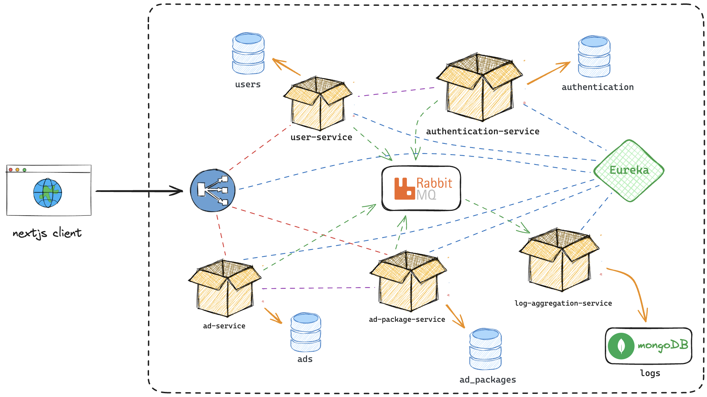
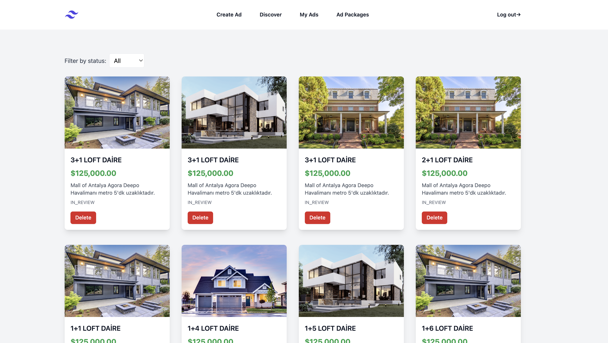
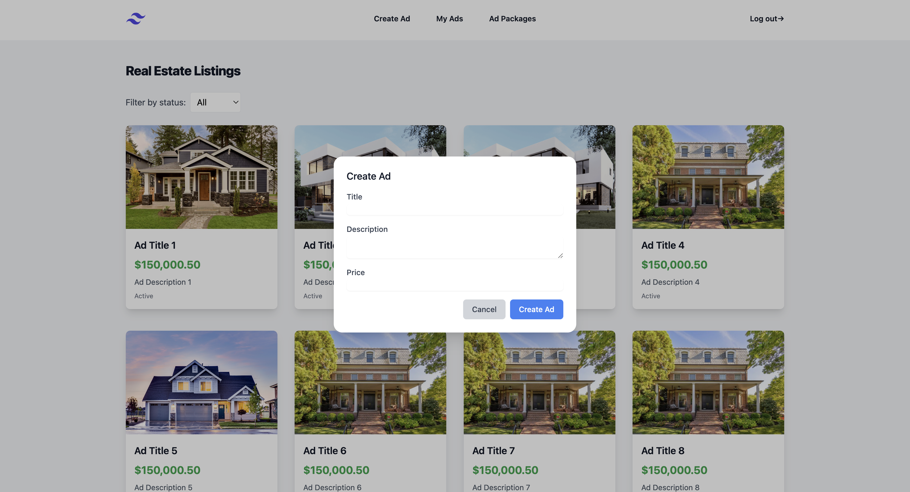
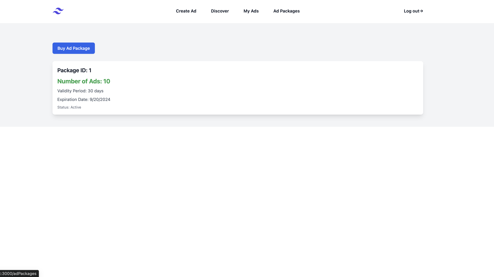

# Final Projesi - FMSS Bilişim Teknoloji Fullstack Web Bootcamp

Bu proje, FMSS Bilişim Teknoloji Fullstack Web Bootcamp'inin final projesidir. Mikroservis mimarisi uygulanarak geliştirilmiştir.

Website: [nbenlioglu.dev](https://www.nbenlioglu.dev/) 
LinkedIn: [Nikolay Benlioglu](https://www.linkedin.com/in/nikolay-benlioglu/) 
GitHub: [nbenliogludev](https://github.com/nbenliogludev) 
Email: [nikbenlioglu@gmail.com](mailto:nikbenlioglu@gmail.com)

## Kısaca Bazı Özellikler

- Her temel servisin kendi veritabanı bulunuyor.
- RabbitMQ ile asenkron mesajlaşma sağlandı.
- Loglar için MongoDB kullanılıyor.
- Eureka service discovery yapısı hazırlandı.
- Next.js ile oluşturulmuş basit bir önyüze sahip.
- Postman üzerinden denenebilir.

## Postman ile deneyin
API adreslerini Postman ile deneyebilirsiniz: [**Postman API** 🚀](https://documenter.getpostman.com/view/5602393/2sA3kVj1Xz)

## Mikroservisler

Aşağıda projeye ait mikroservislerin listesi bulunmaktadır. 
 📦 User Service
 📦 Authentication Service
 📦 Ad Service
 📦 Ad Package Service
 🐝 Log Aggregation Service
 ⛩️ API Gateway
 🌐 Eureka Service Discovery

## Proje Şeması

# Next.js

Next.js projesi, kullanıcıların ilan oluşturma, düzenleme, silme ve detaylarına ulaşma işlemlerini yapabilmesini sağlar.

## Kullandığım Teknolojiler

- **Next.js**
- **TypeScript**
- **React Query**
- **nextAuth**
- **Tailwind CSS**

## Önyüzü çalıştırma adımları

1. Terminalinizi açın ve projenin ana dizinine gidin.
2. `cd nextjs-frontend` komutunu çalıştırarak önyüz projesinin dizinine gidin.
3. `npm install` komutunu çalıştırın gerekli paketlerin yüklenmesini bekleyin.
4. `npm run dev` komutunu çalıştırarak önyüz projesini başlatın.
5. Tarayıcınızda `http://localhost:3000` adresine gidin.

Bu noktaya geldiyseniz harika! Artık projeyi kullanabilirsiniz. 🎉🎉🎉

Dokümanın ilerleyen kısımlarında API dokümantasyonu ve servis açıklamaları yer alıyor.

## UserService [User Service]

Kullanıcı servisi, kullanıcı yönetimi ile ilgilenir. Kullanıcı oluşturma ve silme ve güncelleme işlemlerini sağlar.

### API Adresleri

| Method | Adres                | Açıklama                   |
|--------|----------------------|----------------------------|
| `GET`  | `api/v1/users`       | Kullanıcıları getir        |
| `GET`  | `api/v1/users/{id}`  | Kullanıcı id'si ile getir  |
| `POST` | `api/v1/users`       | Yeni bir kullanıcı oluştur |
| `PUT`  | `api/v1/users/{id}`  | Kullanıcıyı güncelle       |
| `DELETE`| `api/v1/users/{id}`  | Kullanıcıyı sil            |

## AuthenticationService 

AuthenticationService, JWT kullanarak kullanıcı kimlik doğrulama işlemlerini yönetir. Kullanıcı kayıt, giriş, ve çıkış işlemlerini sağlar.

### API Adresleri

| Method | Adres                      | Açıklama                                |
|--------|----------------------------|-----------------------------------------|
| `POST` | `api/v1/auth/register`     | Yeni bir kullanıcı kaydı oluşturur      |
| `POST` | `api/v1/auth/authenticate` | Kullanıcı kimlik doğrulama işlemi yapar |

# İlan Servisi - [Ad Service](ad-service)

İlan Servisi, kullanıcıların ilan oluşturma, güncelleme, silme ve listeleme işlemlerini yapabilmesini sağlar

### API Adresleri

| Method   | Adres                   | Açıklama                   |
|----------|-------------------------|----------------------------|
| `GET`    | `/api/v1/ads`           | Tüm ilanları getir         |
| `GET`    | `/api/v1/ads/{id}`      | İlanı id'si ile getir      |
| `GET`    | `/api/v1/ads/user/{id}` | İlanı user id'si ile getir |
| `POST`   | `/api/v1/ads`           | Yeni bir ilan oluştur      |
| `PUT`    | `/api/v1/ads/{id}`      | Mevcut bir ilanı güncelle  |
| `DELETE` | `/api/v1/ads/{id}`      | Mevcut bir ilanı sil       |

# Paket Servisi - [Ad Package Service](ad-package-service)

Paket Servisi, kullanıcıların ilan yayınlama haklarını yönetir. Kullanıcılar, belirli bir süre ve sayıda ilan yayınlama hakkı sunan paketler satın alabilirler. Paket Servisi, kullanıcıların paketleri oluşturma, güncelleme, silme ve görüntüleme işlemlerini sağlar.

### API Adresleri

| Method   | Adres                          | Açıklama                    |
|----------|--------------------------------|-----------------------------|
| `GET`    | `/api/v1/adPackages`           | Tüm paketleri getir         |
| `GET`    | `/api/v1/adPackages/{id}`      | Paketi id'si ile getir      |
| `GET`    | `/api/v1/adPackages/user/{id}` | Paketi user id'si ile getir |
| `POST`   | `/api/v1/adPackages`           | Yeni bir paket oluştur      |
| `PUT`    | `/api/v1/adPackages/{id}`      | Mevcut bir paketi güncelle  |
| `DELETE` | `/api/v1/adPackages/{id}`      | Mevcut bir paketi sil       |

# Log Toplama Servisi - [Log Aggregation Service](log-aggregation-service)

Log toplama servisi, diğer mikroservislerden üretilen hata ve bilgi loglarını toplar ve MongoDB veritabanına kaydeder.
Bunlara erişmek için bir API sunar. MongoDB veritabanınızı yönetmek için projede Mongo Express de bulunuyor.

### API Adresleri

| Method | Adres                                      | Açıklama              |
|--------|--------------------------------------------|-----------------------|
| `GET`  | `log-aggregation-service/api/v1/info-logs` | Bilgi loglarını getir |
| `GET`  | `log-aggregation-service/api/v1/error-logs`| Hata loglarını getir  |

# API Gateway - [API Gateway](api-gateway)

API Gateway, diğer mikroservislerin API'lerini tek bir noktadan erişilebilir hale getirir. Ayrıca servislerin bulunduğu adresleri Eureka üzerinden alır.

# Eureka Sunucusu - [Eureka Server](eureka-server)

Eureka sunucusu, diğer mikroservislerin kayıt olduğu ve bulunduğu adresleri tutan bir servistir. API Gateway, Eureka üzerinden diğer servislerin adreslerini alır.

## Projenin Önyüzü

### "Discover all" Sayfası
Bu sayfasda, var olan tüm ilanları keşfedebilecekleri bir liste bulunur.

### Benim İlanlarım Sayfası
Bu sayfada, kullanıcının oluşturduğu ilanlar listelenmektedir.

### İlan Oluşturma
Bu sayfada, kullanıcılar yeni bir ilan oluşturmak için gerekli formu doldurabilirler.

### Paketler Sayfası
Bu sayfada, kullanıcılar ilan paketlerini satın alabilirler. Paketler, belirli bir süre ve sayıda ilan yayınlama hakkı sunar.

 

## FMSS Bilişim Teknoloji Fullstack Web Bootcamp

Website: [nbenlioglu.dev](https://www.nbenlioglu.dev/) 
LinkedIn: [Nikolay Benlioglu](https://www.linkedin.com/in/nikolay-benlioglu/) 
GitHub: [nbenliogludev](https://github.com/nbenliogludev) 
Email: [nikbenlioglu@gmail.com](mailto:nikbenlioglu@gmail.com)
